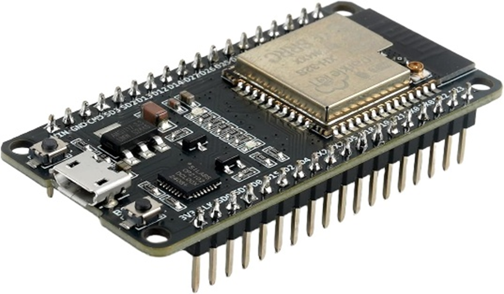
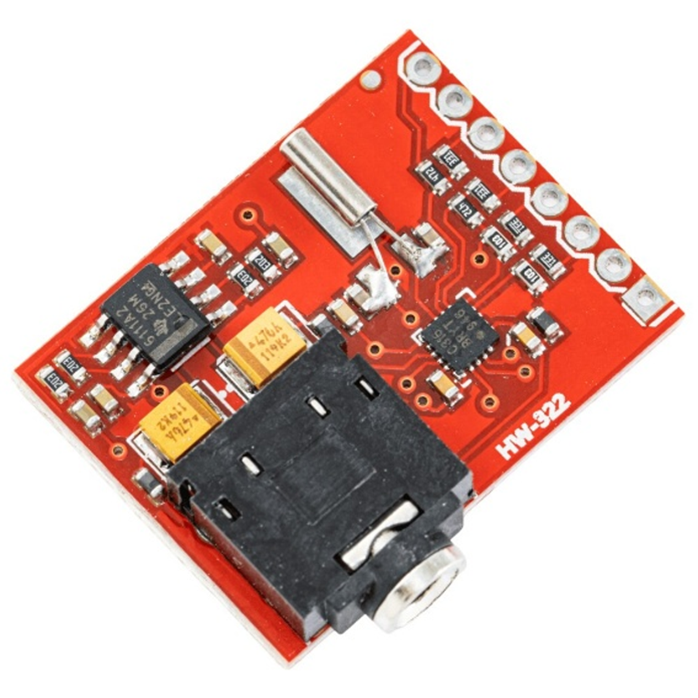
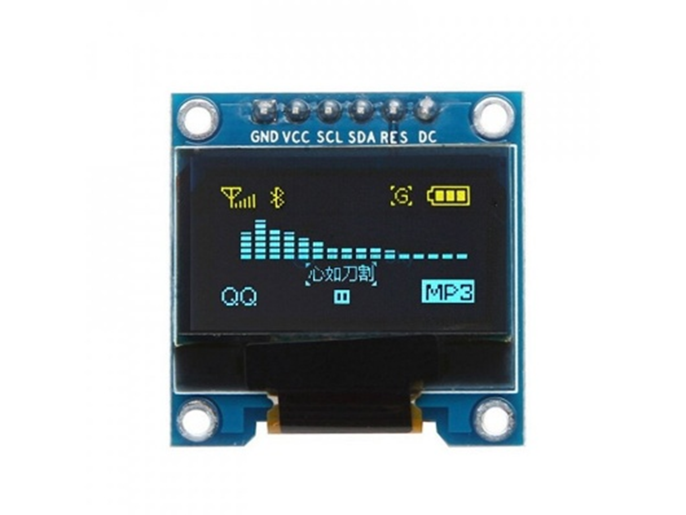
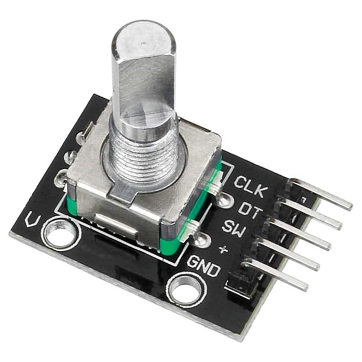
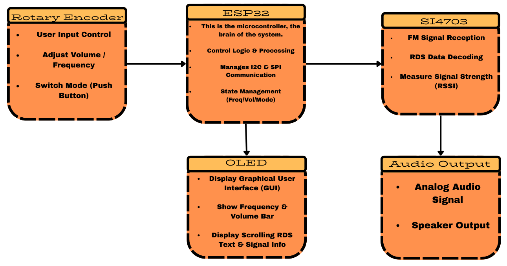
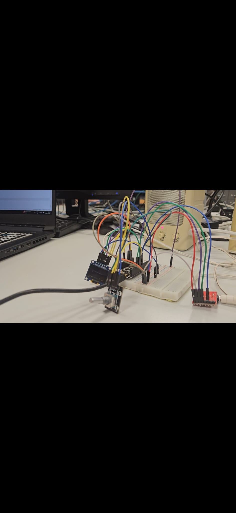

# 📻 FM Radio Receiver - ESP32(MicroPython)

## 📖 I. Overview

The **FM Radio Receiver** is a digitally controlled FM radio system built on the **ESP32** and developed entirely in **MicroPython**.

* It integrates the **Si4703 FM tuner**, an **SSD1306 OLED display**, and a **rotary encoder** to provide a complete, modern, and intuitive radio interface.
* The device supports precise **FM tuning** within the standard **87.5–108.0 MHz** band, real-time **RDS decoding** (station name and radio text), dynamic UI rendering, and responsive physical controls.
* Communication between modules is handled through **I2C**, **SPI**, and **hardware interrupts**, ensuring reliable performance and efficient system operation.

This project demonstrates concepts such as low-level device communication, bit-level data decoding, graphical UI rendering, and event-driven input processing.

<h3>📐 Logic Flowchart</h3>

 

## ⚙️ II. Functions

The main system functions include:

### 1. FM Tuning & Reception
* **Wide Band Support:** Supports the full **87.5–108.0 MHz** FM band.
* **Precision Tuning:** Frequency adjustments in **0.1 MHz** steps.
* **Accurate Feedback:** Reads and displays the actual tuned frequency directly from the **Si4703 registers** to ensure the display matches the hardware state.
* **Signal Handling:** Automatic handling of **stereo/mono** switching based on signal quality.

### 2. RDS (Radio Data System) Decoding
* **Real-time Decoding:** Processes RDS **Group 0A** (Station Name) and **2A** (Radio Text).
* **Data Extraction:** Extracts and displays:
    * **Program Service name (PS):** The station identifier (e.g., "BBC R1").
    * **Radio Text (RT):** Song name, artist, or station messages.
* **Robustness:** Intelligent buffering and error-tolerant reconstruction of incomplete RDS blocks.
* **Scrolling Text:** Automatic scrolling of long Radio Text messages on the display when they exceed screen width.

### 3. Dynamic Graphical Interface (OLED UI)
* **Custom Rendering:** Real-time display rendering using custom graphic primitives on the SSD1306.
* **UI Elements:**
    * **Signal Strength:** Dynamic bar graph (0–5 levels) based on RSSI.
    * **Mode Indicator:** Stereo (ST) vs. Mono (MO) status.
    * **Active Control:** Visual indicator for current mode (**FREQ** vs. **VOL**).
    * **Info Area:** Dedicated area for scrolling RDS text.
* **Performance:** Optimized refresh logic to minimize unnecessary OLED updates and reduce flicker.

### 4. User Input & Control
* **Rotary Encoder Integration:**
    * Used for **Frequency tuning** and **Volume adjustment**.
* **Mode Switching:** Integrated push-button for toggling between control modes.
* **Precision:** Hardware **interrupt-based** rotation detection for immediate response.
* **Stability:** Software debouncing and state management (`50ms`) for fast, accurate input without "skipping".

### 5. System Management
* **Initialization Sequence:** Structured startup (ESP32 → Si4703 Power Up → Oscillator → RDS Enable → UI Init).
* **Polling Architecture:** Periodic polling of tuner status and RDS registers within the main loop.
* **Efficient Concurrency:** Responsive handling of user input, RDS processing, and UI updates in a single non-blocking loop without the use of complex threads.

## 🛠️ III. Hardware Components

| Component & Description | Preview |
| :--- | :---: |
| **ESP32 Development Board** The main microcontroller of the system. It runs MicroPython, communicates with all peripherals, handles the FM tuner, processes RDS data, updates the OLED display, and manages rotary encoder input. Provides I2C, SPI, and hardware interrupt support. 📄 [View Datasheet](https://download.kamami.pl/p573315-FireBeetle%20Board-ESP32%20User%20Manual%20update.pdf) |  |
| **Si4703 FM Tuner Module** A dedicated FM receiver chip that demodulates audio and provides digital RDS data such as Program Service (station name) and Radio Text. It communicates via I2C and reports frequency, signal strength, and stereo/mono status. 📄 [View Datasheet](https://www.alldatasheet.com/html-pdf/201123/SILABS/SI4703/436/2/SI4703.html) |  |
| **SSD1306 OLED Display (128×64)** The graphical user interface of the device. It displays the tuned frequency, signal bars, stereo indicator, RDS text, and control mode. Driven through SPI for faster refresh rates and supports custom graphics. 📄 [View Datasheet](https://cdn-shop.adafruit.com/datasheets/SSD1306.pdf) |  |
| **Rotary Encoder with Push-Button** The main user input device. Rotation controls either frequency or volume, while the integrated push-button switches between modes. Rotation events are captured using hardware interrupts for precise and responsive control. |  |
| **Audio Output (Speakers)** The Si4703 provides an analog audio output that can be fed directly into small speakers. The signal is already suitable for basic listening, and an external amplifier can optionally be added if higher volume is required. |  |

### ↪︎ Block diagram

The block diagram below illustrates the high-level data flow and control logic. The **ESP32** acts as the central controller, bridging the user input, visual feedback, and radio reception.

  
   

 

## 💻 IV. SOFTWARE

This section details the software architecture of the project. The code is designed with a modular approach, where dedicated drivers handle hardware peripherals (Radio, Display, Input), while a central application loop coordinates logic, UI updates, and data processing in real-time.

<h3>📐 File Structure </h3>

 

### 📂 Code Breakdown

#### 1. Main Application (`main-app.py`)
The entry point of the system. It acts as the central orchestrator, initializing all peripherals and managing the event loop.
* **System Initialization:** Sets up the **SPI bus** for the OLED and **I2C bus** for the Si4703 radio.
* **Event Loop (`run`):** Executes a non-blocking `while True` loop that constantly checks for user input and RDS data without halting execution.
* **State Machine:** Manages the active control mode (switching between `FREQ` and `VOL` when the button is pressed).
* **UI Rendering (`draw_interface`):** Handles the logic for drawing signal bars, formatting frequency strings, and calculating the scrolling position for long RDS text.

#### 2. FM Radio Driver (`si4703_driver.py`)
A comprehensive driver that interacts directly with the Si4703 registers via I2C.
* **Register Management:** Handles the complex initialization sequence: Hardware Reset → Oscillator Enable → Power Up → RDS Enable.
* **RDS Decoding (`process_rds`):** Implements a bit-banging approach to decode **Group 0A** (Station Name) and **Group 2A** (Radio Text) packets directly from the register data.
* **Tuning Logic:** Converts human-readable frequency (e.g., 101.5 MHz) into the specific 10-bit channel value required by the chip.
* **Signal Telemetry:** Provides methods to read RSSI (Received Signal Strength Indicator) and Stereo/Mono status.

#### 3. Input Driver (`rotary_encoder_driver.py`)
Handles physical user interaction through the rotary encoder using hardware interrupts for precision.
* **Interrupt Handling (`IRQ`):** Uses `Pin.IRQ_FALLING` on the CLK pin to detect rotation immediately, ensuring no steps are missed during fast turning.
* **Debouncing:** Implements a software debounce timer (`50ms`) to filter out mechanical noise and switch bounce, preventing erratic value jumps.
* **Directional Logic:** Determines clockwise or counter-clockwise rotation by comparing the state of the **DT pin** relative to the **CLK pin**.

#### 4. Display Driver (`ssd1306_driver.py`)
A standard MicroPython driver adapted for high-speed SPI communication with the OLED.
* **Framebuffer Integration:** Inherits from `framebuf.FrameBuffer`, allowing the use of efficient graphics primitives (lines, rectangles, text).
* **SPI Protocol:** Manages the low-level transmission of command bytes and data bytes using the `DC` (Data/Command), `CS` (Chip Select), and `RES` (Reset) pins.
* **Buffer Management:** Maintains a local bytearray buffer of the screen content and pushes it to the display only when `show()` is called, optimizing performance.

## 📷 V. Project Demo

This section presents the visual representation of the project, showcasing the physical circuit assembly and the system in operation. Below you will find detailed photos of the breadboard connections, a direct video demonstration, and the electrical schematic.

### 1. Physical Build
The images below highlight the wiring complexity and the integration of the ESP32, Si4703, and OLED display on the breadboard.

  
   
  <i> Top view showing wiring connections</i>
    
  
   
  <i> Side view of the complete setup</i>

### 2. Video Demonstration
Watch the system in action (tuning, volume, and RDS) directly below.

https://github.com/user-attachments/assets/2bfd630c-2b35-4ec9-9f3d-a8fa236a6961

### 3. Circuit Schematic
The detailed schematic below represents the electrical connections and logic levels used in the project simulation (LTspice) and final assembly.

  

## 📚 VI. Resources & References

This project was built using the following documentation and tools. These resources are essential for understanding the low-level operation of the hardware and the software implementation.

### 📄 Component Datasheets
* **ESP32 Development Board:** [FireBeetle ESP32 User Manual](https://download.kamami.pl/p573315-FireBeetle%20Board-ESP32%20User%20Manual%20update.pdf)
* **Si4703 FM Tuner:** [Silicon Labs Si4703 Datasheet](https://www.alldatasheet.com/html-pdf/201123/SILABS/SI4703/436/2/SI4703.html)
* **SSD1306 OLED Display:** [Solomon Systech SSD1306 Datasheet](https://cdn-shop.adafruit.com/datasheets/SSD1306.pdf)

### 💡 Code References & Tutorials
* **Si4703 Driver Logic:** [GitHub - ryedwards/si4703RaspberryPi](https://github.com/ryedwards/si4703RaspberryPi/blob/master/si4703Library.py) - The Python/Raspberry Pi library used as a reference for porting the driver to MicroPython.
* **OLED Integration:** [MicroPython SSD1306 Tutorial](https://docs.micropython.org/en/latest/esp8266/tutorial/ssd1306.html) - Official guide used for implementing the display driver and graphics.

### 🛠️ Tools & Frameworks
* **MicroPython:** [Official ESP32 Documentation](https://docs.micropython.org/en/latest/esp32/quickref.html) - Used for the firmware logic.
* **Thonny IDE:** [Official Website](https://thonny.org/) - Used for writing code and flashing the ESP32.
* **LTspice:** [Analog Devices Simulation](https://www.analog.com/en/design-center/design-tools-and-calculators/ltspice-simulator.html) - Used for circuit logic verification.

### 🔗 Protocols & Concepts
* **RDS (Radio Data System):** [Technical Overview](https://en.wikipedia.org/wiki/Radio_Data_System) - Information on Group 0A (Station Name) and Group 2A (Radio Text) structures.
* **I2C Communication:** [I2C Info](https://i2c.info/) - Protocol used for the Si4703.
* **SPI Communication:** [SPI Basics](https://en.wikipedia.org/wiki/Serial_Peripheral_Interface) - Protocol used for the OLED display.

---

    <i>Project developed by:</i> 
    Baciu Petru Rareș 
    Gyorfi Csaba Norbert 
    Nicoară Paul Nicolae 
    Pleshyvtsev Maksym

